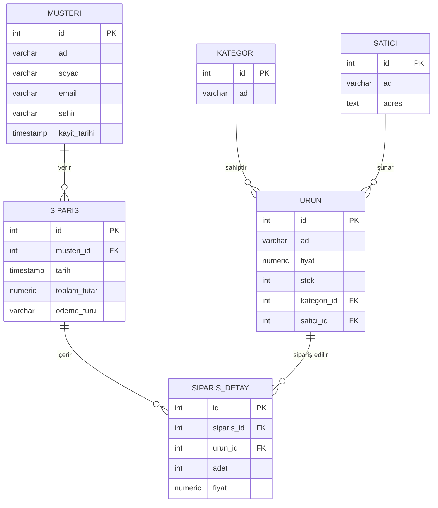

# 🛒 Online Alışveriş Sistemi Ödevi

Bu proje, bir **online alışveriş sistemi** için PostgreSQL tabanlı bir veritabanı tasarımıdır.  
Proje, müşteri kayıtlarından ürün ve sipariş yönetimine kadar uçtan uca bir e-ticaret altyapısının **temelini** oluşturur.  

## 🚀 Özellikler
- **Müşteri Yönetimi** (ad, soyad, e-posta, şehir, kayıt tarihi)  
- **Ürün Yönetimi** (stok, fiyat, kategori, satıcı ilişkisi)  
- **Kategori Yönetimi** (ürünleri sınıflandırma)  
- **Satıcı Yönetimi** (ürün sağlayıcıları tanımlama)  
- **Sipariş Yönetimi** (müşteri, ödeme türü, toplam tutar)  
- **Sipariş Detayları** (her siparişte ürün, adet ve fiyat bilgisi)  
- **İndeksler** ile performans artırımı  
- **Raporlama Sorguları** (en çok satan ürün, en çok sipariş veren müşteri, kategori bazlı satışlar, aylık sipariş sayısı vb.)  

---

## 🗂️ Veritabanı Tabloları
1. **Müşteri (`musteri`)**
   - `id`, `ad`, `soyad`, `email`, `sehir`, `kayit_tarihi`
2. **Kategori (`kategori`)**
   - `id`, `ad`
3. **Satıcı (`satici`)**
   - `id`, `ad`, `adres`
4. **Ürün (`urun`)**
   - `id`, `ad`, `fiyat`, `stok`, `kategori_id`, `satici_id`
5. **Sipariş (`siparis`)**
   - `id`, `musteri_id`, `tarih`, `toplam_tutar`, `odeme_turu`
6. **Sipariş Detay (`siparis_detay`)**
   - `id`, `siparis_id`, `urun_id`, `adet`, `fiyat`

---

## 🔗 İlişkiler
- Bir **müşteri** → birçok **sipariş** verebilir.  
- Bir **sipariş** → birçok **ürün** içerebilir (siparis_detay).  
- Bir **ürün** → bir **kategori**ye ve bir **satıcı**ya aittir.  
- Bir **kategori** → birçok ürünü kapsar.  
- Bir **satıcı** → birçok ürün satabilir.  

---

## 📊 ER Diyagramı

---

## 🛠️ Kullanım
1. `alışveriş.sql` dosyasını PostgreSQL üzerinde çalıştırın.  
2. Tablolar otomatik olarak oluşturulacak ve örnek veriler eklenecektir.  
3. Raporlama sorgularını çalıştırarak analizler yapabilirsiniz.  
